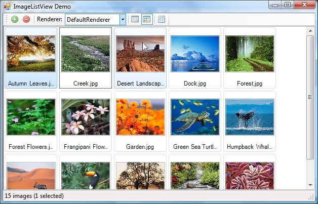
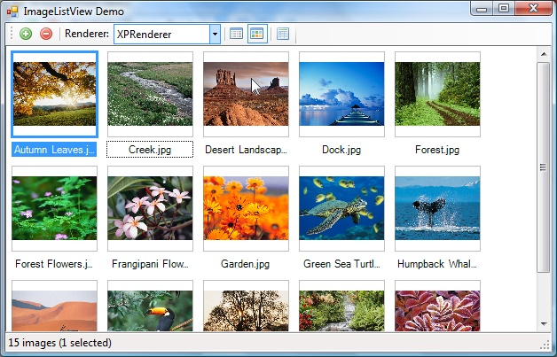
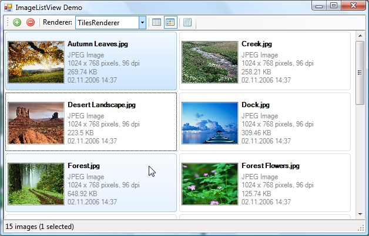
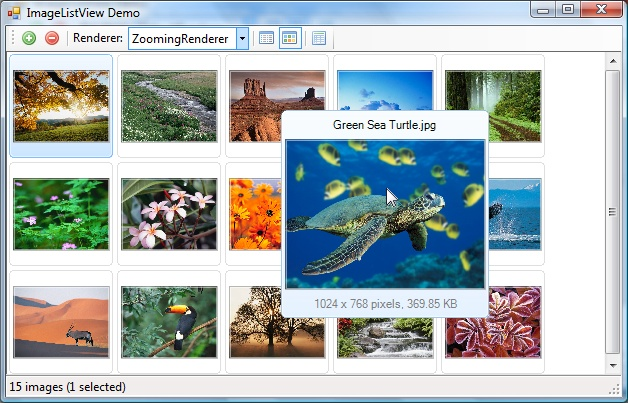
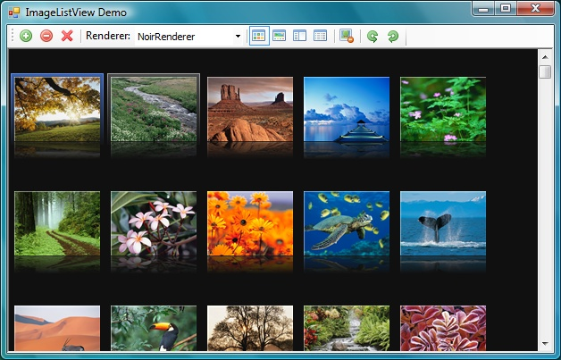

# Introduction #

The look of ImageListView can be customized with renderers. You can either use one of the built-in custom renderers below, or write your own custom renderer by deriving from @Manina.Windows.Forms.ImageListView.ImageListViewRenderer.

# Custom renderers #

## Built-in custom renderers ##

You can find these renderers in the source code and the latest binaries. To use a built-in custom renderer, use the Manina.Windows.Forms.ImageListView.SetRenderer(Manina.Windows.Forms.ImageListView.ImageListViewRenderer,System.Boolean) method as below:

```cs
myImageListView.SetRenderer(new ImageListViewRenderers.XPRenderer());
```

### DefaultRenderer ###



_The default renderer in action. Item states from left-to-right: selected, focused, mouse over._

### XPRenderer ###



_A renderer mimicking the Windows XP look. Item states from left-to-right: selected, focused._

### TilesRenderer ###

You can set the size of the description area in the constructor.

```cs
// Create a new TilesRenderer and set the size
// of the description area to 180 pixels
myImageListView.SetRenderer(new ImageListViewRenderers.TilesRenderer(180));
```



_Tiles renderer displays items with more details. Item states from top-to-bottom: selected, focused, mouse over._

### ZoomingRenderer ###

You can set the zoom factor in the constructor.

```cs
// Create a new ZoomingRenderer and set the
// zoom factor to 50%
myImageListView.SetRenderer(new ImageListViewRenderers.ZoomingRenderer(0.5f));
```



_Zooming renderer displays large items on mouse over._

### NoirRenderer ###

Displays the control with a dark theme.



_Noir renderer in action._

### PanelRenderer ###

This renderer is obsolete and is no longer included in the source code. The new Pane view mode provides the functionality of `PanelRenderer`.

## Writing a Custom Renderer ##

In order to write a custom renderer, derive from `ImageListViewRenderer` and override the virtual functions:

```cs
public MyCustomRenderer : ImageListView.ImageListViewRenderer
{
  // Override virtual functions as required
}
```

### Virtual Functions ###

The base renderer class `ImageListViewRenderer` exposes the following virtual functions.

#### InitializeGraphics ####

`InitializeGraphics` performs one time initialization of the Graphics used to draw the control.

```cs
public virtual void InitializeGraphics(Graphics g)
{
    base.InitializeGraphics(g);
    // Change the InterpolationMode to NearestNeighbor.
    // This will effect all drawing operations.
    g.InterpolationMode = InterpolationMode.NearestNeighbor;
}
```

#### MeasureColumnHeaderHeight ####

Returns the height of column headers. The base class returns the pixel height of the header font with a 2 pixel padding added.

```cs
public virtual int MeasureColumnHeaderHeight()
{
    // Add 4 pixel padding to the base font height.
    return ImageListView.HeaderFont.Height + 8;
}
```

#### MeasureItem ####

Returns the item size for the given view mode. The view mode passed to the function may be different from the current view mode of the control.

```cs
public virtual Size MeasureItem(View view)
{
    if (view == View.Thumbnails)
    {
        // Add 4 pixel padding on all sides to the thumbnail size.
        return new ImageListView.ThumbnailSize + new Size(8, 8);
    }
    else if (view == View.Details)
    {
        // Revert to base class
        base.MeasureItem(view)
    }
}
```

#### DrawBackground ####

Draws the background of the control. The base class clears the background with the background color and draws the background image, if any.

```cs
public virtual void DrawBackground(Graphics g, Rectangle bounds)
{
    base.DrawBackground(g, bounds)
    // Overlay a custom background image
    g.DrawImage(myImage, 10, 10);
}
```

#### DrawSelectionRectangle ####

Draws the selection rectangle.

```cs
public virtual void DrawSelectionRectangle(Graphics g, Rectangle selection)
{
    g.FillRectangle(SystemBrushes.Highlight, selection);
}
```

#### DrawItem ####

Draws an `ImageListViewItem` on the given graphics. The item state passed to the function may be different from the actual item state.

```cs
public virtual void DrawItem(Graphics g, ImageListViewItem item, ItemState state, Rectangle bounds)
{
    if (ImageListViewItem.View == View.Thumbnails)
    {
        if((state & ItemState.Selected) != ItemState.None)
          g.FillRectangle(SystemBrushes.Highlight, bounds);

        g.DrawImage(item.ThumbnailImage, 4, 4);
    }
    else if (ImageListViewItem.View == View.Details)
    {
        // Revert to base class
        base.DrawItem(g, item, state, bounds)
    }
}
```

#### DrawColumnHeader ####

Draws the column headers.

```cs
public virtual void DrawColumnHeader(Graphics g, ImageListViewColumnHeader column, ColumnState state, Rectangle bounds)
{
    base.DrawColumnHeader(g, column, state, bounds);
    // Outline the hovered column
    if((state & ColumnState.Hovered) == ColumnState.Hovered)
        g.DrawRectangle(Pens.Yellow, bounds);
}
```

#### DrawColumnExtender ####

Draws the extender after the last column.

```cs
public virtual void DrawColumnExtender(Graphics g, Rectangle bounds)
{
    // Do not draw an extender
    ;
}
```

#### DrawGalleryImage ####

Draws the large preview image of the focused item in Gallery view mode.

```cs
public virtual void DrawGalleryImage(Graphics g, ImageListViewItem item, Image image, Rectangle bounds)
{
    base.DrawGalleryImage(g, item, image, bounds);
    g.DrawRectangle(Pens.Black, bounds);
}
```

#### DrawPane ####

Draws the left pane in pane view mode. The base class draws the preview image and image metadata.

```cs
public virtual void DrawPane(Graphics g, ImageListViewItem item, Image image, Rectangle bounds)
{
    ;
}
```

#### DrawInsertionCaret ####

Draws the insertion caret for drag-and-drop operations.

```cs
public virtual void DrawInsertionCaret(Graphics g, Rectangle bounds)
{
    // Draw a red caret
    g.FillRectangle(Brushes.Red, bounds);
}
```

#### OnLayout ####

Used to affect the size of the item display area before the layout is calculated.

```cs
public virtual void OnLayout(LayoutEventArgs e)
{
    // Add a 10 pixel margin to the 
    // left of the item display area
    e.ItemAreaBounds.X += 10;
    e.ItemAreaBounds.Width -= 10;
}
```

#### Dispose ####

Releases managed resources. You can override this method to dispose the local managed resources you created.

```cs
public virtual void Dispose()
{
    base.Dispose();

    // Dispose local resources
    myFont.Dispose();
    myBrush.Dispose();
}
```

### Properties ###

`ImageListViewRenderer` also exposes the following public properties:

#### ColumnHeaderBounds ####

Returns the extents of the column header area.

#### ItemAreaBounds ####

Returns the extents of the item area.

#### ImageListView ####

Returns the instance of the `ImageListView` control owning the renderer.

#### Clip ####

When set to `true`, Graphics are not clipped when drawing elements. `ZoomingRenderer` uses this to render mouse-over items outside their bounding boxes. Defaults to `false`.

#### ItemDrawOrder ####

Used to set a particular draw order. Possible values are:

  * `ItemIndex`: Draw order is determined by item insertion index. (Default)
  * `ZOrder`: Draw order is determined by the `ZOrder` properties of items.
  * `NormalSelectedHovered`: Normal (neither selected nor hovered) items are drawn first, followed by selected items and hovered items.
  * `NormalHoveredSelected`: Normal items are drawn first, followed by hovered items and selected items.
  * `SelectedNormalHovered`: Selected items are drawn first, followed by normal items and hovered items.
  * `SelectedHoveredNormal`: Selected items are drawn first, followed by hovered items and normal items.
  * `HoveredNormalSelected`: Hovered items are drawn first, followed by normal items and selected items.
  * `HoveredSelectedNormal`: Hovered items are drawn first, followed by selected items and normal items.